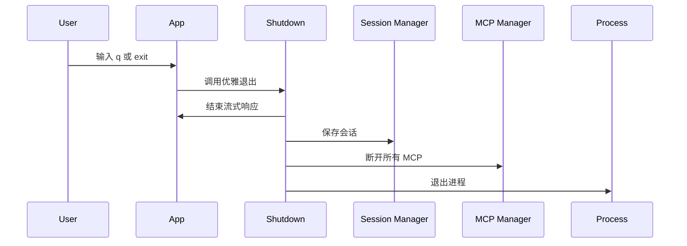

# 1. 问题

App 组件在处理退出命令时直接调用 `process.exit(0)`，没有执行统一的资源清理与会话最终持久化，存在 MCP 子进程未断开、流式响应未收尾的风险。

## 1.1. **直接进程退出，跳过 MCP 清理**
- 位置：`src/ui/App.tsx` 第 52-56 行的 `handleUserMessage`。
- 现状：收到 `q`、`exit`、`quit` 输入时，立即 `process.exit(0)`。

```tsx
// before
const handleUserMessage = async (userInput: string) => {
  if (userInput === 'q' || userInput === 'exit' || userInput === 'quit') {
    process.exit(0);
  }
  // ...
}
```

- 问题：直接退出会绕过 MCP 断连。虽然 `MCPServerManager` 提供了 `disconnectAll()`，但当前未调用。

```ts
// MCP 断连能力已存在
export class MCPServerManager {
  async disconnectAll(): Promise<void> {
    const disconnectPromises: Promise<void>[] = [];
    for (const [name, client] of this.servers.entries()) {
      disconnectPromises.push(client.disconnect().catch(/* ... */));
    }
    await Promise.all(disconnectPromises);
    this.servers.clear();
    this.serverConfigs.clear();
  }
}
```

## 1.2. **退出路径缺少统一入口与信号处理**
- 位置：`src/commands/start.ts`。
- 现状：仅渲染 Ink 应用，没有对 `SIGINT`（Ctrl+C）、`SIGTERM` 注册统一的优雅退出处理。
- 问题：用户通过快捷键或外部信号结束进程时，清理流程可能被绕过，导致资源与状态不一致。

## 1.3. **流式响应中退出可能丢失状态**
- 位置：`src/ui/App.tsx` 中的流式处理与持久化逻辑（第 69-151 行）。
- 现状：正常结束会调用 `endStreaming()` 并 `saveSession()`；但当用户在流式响应中直接触发退出时，这两个步骤可能被跳过。
- 风险：思考步骤与最后一段内容缓冲未清空或未保存，导致会话文件与用户界面状态不一致。

# 2. 收益

统一优雅退出流程后，保证 MCP 断连与会话最终保存，降低资源泄漏与状态不一致的风险。

## 2.1. **降低资源泄漏风险**
- 通过在退出前调用 `disconnectAll()`，确保 MCP 子进程被终止，pending 请求被统一拒绝，异常通道被收敛。
- 预期将“退出后残留 MCP 子进程”的概率在正常路径上降低到 **0**。

## 2.2. **提升会话持久化一致性**
- 在退出前统一执行 `saveSession()`，使最终消息、待办等上下文能落盘。
- 流式响应收尾（`endStreaming()`）后再保存，避免半截内容进入会话文件。

## 2.3. **增强健壮性与可测试性**
- 退出逻辑集中为单点，可在单元测试或集成测试中模拟不同退出来源（命令、信号）进行验证。
- 异常与边界路径更容易被覆盖与审计。

# 3. 方案

总体思路：引入统一的“优雅退出”模块，集中处理 UI 收尾、会话最终保存、MCP 断连，并在 `App` 组件与进程信号中统一走该入口。

## 3.1. 项目退出流程示意图



该图展示统一退出入口如何串联 UI 收尾、会话持久化与 MCP 断连，最后才退出进程。

## 3.2. **引入 ShutdownService：解决“退出路径缺少统一入口”**

- 核心思想：新增 `src/runtime/shutdown.ts` 导出 `gracefulShutdown()`，封装退出前的所有清理逻辑，并具备去重保护（防止重复触发）。
- 适用范围：被 `App` 组件与进程信号处理统一使用。

```ts
// src/runtime/shutdown.ts
import { getGlobalMCPManager } from '../mcp/index.js';
import { SessionManager, SessionContext } from '../session/index.js';

let shuttingDown = false;

export async function gracefulShutdown(
  currentContext: SessionContext | null,
  opts: { reason?: string } = {}
): Promise<void> {
  if (shuttingDown) return;
  shuttingDown = true;

  // 1) 断开所有 MCP
  try {
    const manager = getGlobalMCPManager();
    await manager.disconnectAll();
  } catch (e) {
    console.error('[Shutdown] MCP disconnect error:', e);
  }

  // 2) 最终保存会话
  try {
    if (currentContext) {
      const sm = new SessionManager();
      sm.saveSession(currentContext);
    }
  } catch (e) {
    console.error('[Shutdown] Session save error:', e);
  }
}
```

## 3.3. **修改 App.tsx 退出逻辑：解决“直接进程退出”和“流式响应中退出可能丢失状态”**

- 实施要点：
  - 在退出前先执行 UI 收尾：`endStreaming()`、清理思考步骤、复位处理状态。
  - 调用 `gracefulShutdown(sessionContext)` 完成会话最终保存与 MCP 断连。
  - 最后再调用 `process.exit(0)`。

```tsx
// before（节选）
if (userInput === 'q' || userInput === 'exit' || userInput === 'quit') {
  process.exit(0);
}
```

```tsx
// after（节选）
import { gracefulShutdown } from '../runtime/shutdown.js';

if (userInput === 'q' || userInput === 'exit' || userInput === 'quit') {
  // UI 收尾，避免半截流
  endStreaming();
  clearThinkingSteps();
  setIsProcessing(false);
  setIsGenerating(false);

  // 会话最终保存 + MCP 断连
  await gracefulShutdown(sessionContext, { reason: 'user_exit' });

  // 真正退出
  process.exit(0);
}
```

- 说明：将退出顺序明确化，避免丢失最后一段流式内容与待办更新。

## 3.4. **在 start.ts 注册信号处理：补齐统一入口覆盖 Ctrl+C**

- 实施要点：
  - 监听 `SIGINT`、`SIGTERM`，在信号触发时执行与 App 一致的退出流程。
  - 由于 `start.ts` 不持有 App 的内部状态，可通过 `SessionManager.getCurrentSession()` 获取最后一次保存的上下文进行兜底持久化。

```ts
// src/commands/start.ts（关键增量）
import { gracefulShutdown } from '../runtime/shutdown.js';

export async function startCommand(options: StartOptions): Promise<void> {
  // ...初始化省略
  render(React.createElement(App));

  const doSignalExit = async (reason: string) => {
    try {
      const sm = new SessionManager();
      const ctx = sm.getCurrentSession();
      await gracefulShutdown(ctx, { reason });
    } finally {
      process.exit(0);
    }
  };

  process.on('SIGINT', () => void doSignalExit('sigint'));
  process.on('SIGTERM', () => void doSignalExit('sigterm'));
}
```

- 说明：即使是外部信号导致退出，也能保证 MCP 断连与会话文件处于一致状态。

# 4. 回归范围

本次改动主要影响“退出”的各类路径，需要从端到端流程角度验证资源清理与会话一致性。

## 4.1. 主链路
- 用例一：用户在非流式状态下输入 `q` 退出。
  - 预期：`endStreaming()` 不报错，`saveSession()` 执行一次，MCP 全部断连，进程退出。
- 用例二：用户在流式响应过程中输入 `q`。
  - 预期：先结束流式再保存会话，缓冲区不会进入半截内容，MCP 全部断连。
- 用例三：Ctrl+C（`SIGINT`）退出。
  - 预期：统一走 `gracefulShutdown`，会话文件可用，MCP 无残留子进程。
- 用例四：`SIGTERM` 退出（模拟外部停止）。
  - 预期：与 `SIGINT` 一致。

## 4.2. 边界情况
- MCP 断连失败：`disconnectAll()` 某些服务抛错。
  - 预期：错误被捕获记录，不影响会话最终保存与进程退出。
- 会话保存失败：磁盘不可写或路径异常。
  - 预期：错误被捕获记录，仍退出进程；后续可在日志层面告警。
- 重复触发退出：短时间多次输入 `q` 或信号与命令同时触发。
  - 预期：`gracefulShutdown` 去重保护生效，实际清理只执行一次。
- 未配置 MCP：无服务器连接场景。
  - 预期：清理流程跳过 MCP 断连分支，均能正常退出。
